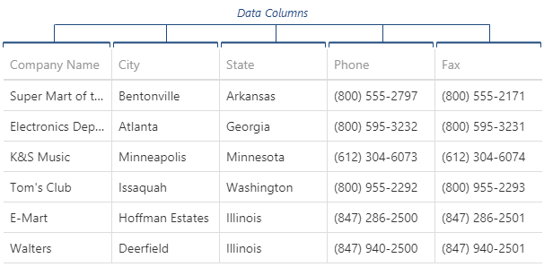
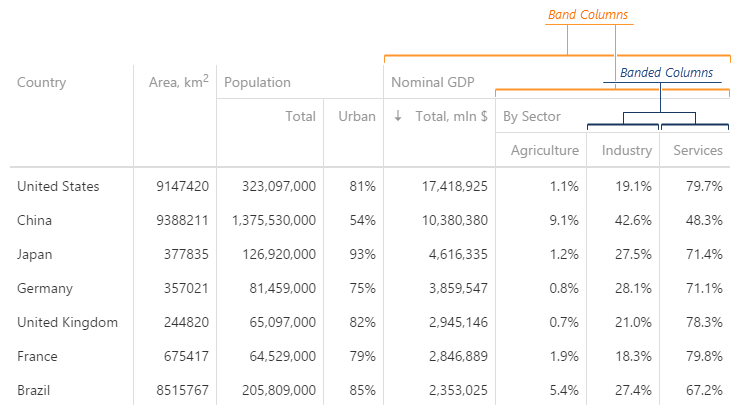
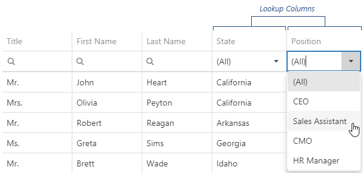
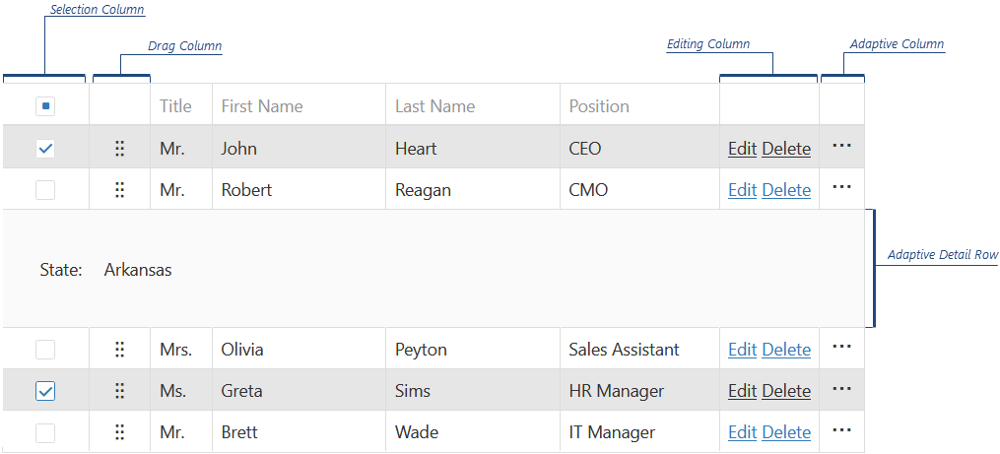

## Data Binding

### Array

```js
$(function() {
    const employees = [
        { ID: 1, FirstName: "Sandra", LastName: "Johnson" },
        { ID: 2, FirstName: "James", LastName: "Scott" },
        { ID: 3, FirstName: "Nancy", LastName: "Smith" }
    ];
 
    $("#dataGridContainer").dxDataGrid({
        dataSource: employees,
        keyExpr: "ID"
    });
});
```

```js
$(function() {
    const employees = [
        { ID: 1, FirstName: "Sandra", LastName: "Johnson" },
        { ID: 2, FirstName: "James", LastName: "Scott" },
        { ID: 3, FirstName: "Nancy", LastName: "Smith" }
    ];

    const employeesStore = new DevExpress.data.ArrayStore({
        data: employees,
        key: "ID",
        onLoaded: function() {
            // ...
        }
    });
 
    const employeesDataSource = new DevExpress.data.DataSource({
        store: employeesStore,
        sort: "LastName"
    });
 
    $("#dataGridContainer").dxDataGrid({
        dataSource: employeesDataSource
    });
});
```

### Ajax

```js
let url = "https://69c214b97518bf8facbd35ad.mockapi.io/users"

let store = new DevExpress.data.CustomStore({
    key: "id",
    load: function () {
        return $.ajax({
            url: url,
            method: "get"
        })
    }
});

$("#grid").dxDataGrid({
    dataSource: store,
    key: "id"
})
```

```js
$("#grid").dxDataGrid({
    dataSource: {
        load: function () {
            return $.ajax({
                url: url,
                method: "GET"
            });
        }
    },
    columns: ["id", "name", "email"]
})
```

## Paging

| Option                        | Type               | Description                    |
| ----------------------------- | ------------------ | ------------------------------ |
| `paging.enabled`              | boolean            | Enable/disable paging          |
| `paging.pageSize`             | number             | Records per page               |
| `paging.pageIndex`            | number             | Current page (0-based)         |
| `pager.visible`               | boolean            | Show pager UI                  |
| `pager.showPageSizeSelector`  | boolean            | Allow user to change page size |
| `pager.allowedPageSizes`      | array              | Page size options              |
| `pager.showInfo`              | boolean            | Show "Page 1 of X"             |
| `pager.showNavigationButtons` | boolean            | Show next/prev buttons         |
| `pager.displayMode`           | "full" / "compact" | Pager UI style                 |


```js
paging: {
    pageSize: 5
},

pager: {
    visible: true,
    showPageSizeSelector: true,
    allowedPageSizes: [5, 10, 15],
    showInfo: true,
    showNavigationButtons: true,
    displayMode: "compact"
}
```

## Scroling

- how data is rendered and loaded when user scrolls.

| Mode       | Description      | Data Handling           | Best For       |
| ---------- | ---------------- | ----------------------- | -------------- |
| `standard` | Normal scrolling | Loads all data          | Small data     |
| `virtual`  | Lazy loading     | Loads visible rows only | 🔥 Large data  |
| `infinite` | Endless scroll   | Appends data            | Social/feed UI |


| Property              | Type             | Default      | Purpose                    |
| --------------------- | ---------------- | ------------ | -------------------------- |
| `mode`                | string           | `"standard"` | Scrolling type             |
| `rowRenderingMode`    | string           | `"standard"` | Row rendering optimization |
| `columnRenderingMode` | string           | `"standard"` | Column virtualization      |
| `preloadEnabled`      | boolean          | `false`      | Preload next data          |
| `useNative`           | boolean / "auto" | `"auto"`     | Native scroll              |
| `scrollByContent`     | boolean          | `true`       | Touch scroll               |
| `scrollByThumb`       | boolean          | `true`       | Scrollbar drag             |
| `showScrollbar`       | string           | `"onHover/onScroll"`  | Scrollbar visibility       |


## Editing

```js
editing: {
    allowUpdating: true, 
    allowAdding: true, 
    allowDeleting: true,
    mode: 'row' // 'batch' | 'cell' | 'form' | 'popup'
},
```

### APIs

#### 1. Add

- Use the ***addRow()*** method to add an empty row.

```js
$("#dataGridContainer").dxDataGrid("addRow");
```

- You can specify initial values for a newly added row in the ***onInitNewRow*** event handler.

```js
 $("#dataGridContainer").dxDataGrid({
    // ...
    columns: [{
        dataField: "Hire_Date",
        dataType: "date"
    },
        // ...
    ],
    onInitNewRow: function(e) {
        e.data.Hire_Date = new Date();
    }
});
```

#### 2. Update

- The ***cellValue(rowIndex, visibleColumnIndex, value)*** method updates a cell's value.
- After a value is updated, save it to the data source by calling the ***saveEditData()*** method.

```js
$("#updateCellButton").dxButton({
    text: "Update Cell",
    onClick: function() {
        $("#dataGridContainer").dxDataGrid("cellValue", 1, "Position", "CTO");
        $("#dataGridContainer").dxDataGrid("saveEditData");
    }
});
```

- You can check if there are any unsaved changes by calling the ***hasEditData()*** method. Use the ***saveEditData()*** or ***cancelEditData()*** method to save or cancel them

```js
$("#saveChangesButton").dxButton({
    text: "Save changes",
    onClick: function() {
        var dataGrid = $("#dataGridContainer").dxDataGrid("instance");
        if(dataGrid.hasEditData()) {
            dataGrid.saveEditData().then(() => {
                if(!dataGrid.hasEditData()) {
                    // Saved successfully
                } else {
                    // Saving failed
                }
            });
        }
    }
});
```

#### 3. Delete

-  ***deleteRow(rowIndex)*** method to delete a specific row from the data source.
- This method invokes a confirmation dialog that allows a user to cancel deletion.
- The ***confirmDelete*** property allows you to hide this dialog instantly deleting the selected row from the data source.

```js
$(function() {
    var dataGrid = $("#dataGridContainer").dxDataGrid({
        // ...
        editing: {
            mode: "row", 
            allowDeleting: true,
            confirmDelete: false
        }
    }).dxDataGrid("instance");
 
    $("#deleteRowButton").dxButton({
        text: "Delete Row",
        onClick: function() {
            // Deletes the second row
            dataGrid.deleteRow(1);
        }
    });
});
```

- Note that in batch mode a row is only marked as deleted.
- To save changes, call the ***saveEditData()*** method.
- Calling the ***undeleteRow(rowIndex)*** method cancels row deletion.

```js
$("#dataGridContainer").dxDataGrid("undeleteRow", 1);
```

#### 4. Get Current Cell Values

- To get current cell values (saved or unsaved), call ***cellValue(rowIndex, dataField)***.
- To get row indexes, you can utilize ***getRowIndexByKey(key)***.

### Events

1. onRowInserting
2. onRowInserted
3. onRowUpdating
4. onRowUpdated
5. onRowRemoving
6. onRowRemoved

- In addition, the DataGrid raises the ***initNewRow*** event when a new row is added and the ***editingStart*** event when a row enters the editing state. 

### Customize Editor

#### 1. editorOptions

```js
$("#grid").dxDataGrid({
    columns: [
        {
            dataField: "Note",
            editorOptions: {
                height: 150,
                placeholder: "Enter note..."
            }
        }
    ]
});
```

#### 2. onEditorPreparing

```js
onEditorPreparing: function(e) {
    // e contains full editor context
}
```

| Property          | Description                               |
| ----------------- | ----------------------------------------- |
| `e.dataField`     | Column name                               |
| `e.editorName`    | Editor type (can change)                  |
| `e.editorOptions` | Editor configuration                      |
| `e.parentType`    | Where editor is used (dataRow, filterRow) |
| `e.row`           | Row data                                  |
| `e.setValue()`    | Set value manually                        |

```js
onEditorPreparing: function(e) {
    if (e.dataField === "Note") {
        e.editorName = "dxTextArea"; // change TextBox → TextArea
    }
}


onEditorPreparing: function(e) {
    if (e.dataField === "Note") {

        const defaultHandler = e.editorOptions.onValueChanged;

        e.editorOptions.onValueChanged = function(args) {

            console.log("New Value:", args.value);

            // Update grid value
            e.setValue(args.value);

            // OR call default behavior
            defaultHandler(args);
        };
    }
}


onEditorPreparing: function(e) {
    if (e.dataField === "LastName" && e.parentType === "dataRow") {

        e.editorOptions.disabled =
            e.row.data.FirstName === "";
    }
}
```

#### 3. editCellTemplate

```js
columns: [{
    dataField: "isActive",
    editCellTemplate: function(cellElement, cellInfo) {

        $("<input type='checkbox'>")
            .prop("checked", cellInfo.value)
            .on("change", function(e) {
                cellInfo.setValue(e.target.checked);
            })
            .appendTo(cellElement);
    }
}]
```

### Form Layout

```js
columns: [
    {
        dataField: "ID",
        formItem: {
            visible: false
        }
    }, 
    {
        dataField: "Notes",
        formItem: {
            colSpan: 2, 
            cssClass: "custom-class",
            editorType: 'dxTextArea',
            label: {
                location: "top"
            },
            editorOptions: {    
                height: 100,
                labelMode: "floating"
            },
        }
    }
]
```

## Validation

- add ValidationRules in Columns

```js
columns: [
    {
        dataField: "id",
        width: "50px",
        alignment: "center",
    },
    {
        dataField: "name",
        alignment: "center",
        // customize form layout
        formItem: {
            rowSpan: 2,
            colSpan: 2,
            cssClass: "custom-class",
            editorType: 'dxTextBox',
            label: {
                location: "top"
            },
            editorOptions: {
                height: 100,
                label: "Name",
                labelMode: "floating",
            },
        },
        validationRules: [{ type: "required" }]
    },
    {
        dataField: "email",
        alignment: "center",
        validationRules: [{ type: "email" }, {type: "required"}]
    },
    {
        dataField: "bod",
        alignment: "center",
        dataType: "date",
    },
    {
        dataField: "isActive",
        alignment: "center",
        width: "50px",
        dataType: "boolean",
        editCellTemplate: function (cellElement, cellInfo) {

            $("<input type='checkbox'>")
                .prop("checked", cellInfo.value)
                .on("change", function (e) {
                    cellInfo.setValue(e.target.checked);
                })
                .appendTo(cellElement);
        }
    }
]
```

## Grouping

```js
// add Grouping options on right click on column
grouping: {
    contextMenuEnabled: true,
    expandMode: "rowClick",  // or "buttonClick"
    autoExpandAll: false, // by default expanded all true or false
    allowCollapsing: true // false
},
// allow group panel with drag and drop feature
groupPanel: {
    visible: true,   // or "auto"
    allowColumnDragging: true, // false
},

// default grouping when app start/load
columns: [
    { dataField: 'Country', groupIndex: 1 },
    { dataField: 'Continent', groupIndex: 0 },
]
```

### Methods
```js
// Exapnd all groups from 0 to groupIndex
dataGrid.expandAll(groupIndex);

// collapse all group from 0 to groupIndex
dataGrid.collapseAll(groupIndex);

// to clear all grouping
dataGrid.clearGrouping();
```

### Events

```js
$("#dataGridContainer").dxDataGrid({
    onRowExpanding: function (e) {
        // Handler of the "rowExpanding" event
    },
    onRowExpanded: function (e) {
        // Handler of the "rowExpanded" event
    },
    onRowCollapsing: function (e) {
        // Handler of the "rowCollapsing" event
    },
    onRowCollapsed: function (e) {
        // Handler of the "rowCollapsed" event
    }
});
```

### Summary

```js
summary: {
    recalculateWhileEditing: true,
    groupItems: [
        {
            column: "id",
            summaryType: "count", // min, max, sum, avg, custom
        },
        {
            column: "salary",
            summaryType: "sum",
            showInGroupFooter: true
        },
        {
            column: "salary",
            summaryType: "max",
            alignByColumn: true
        },
        {
            column: "salary",
            summaryType: "min",
            alignByColumn: true
        }
    ]
} 
```

- custom summaryType

```js
summary: {
    totalItems: [
        { name: "customSummary1", summaryType: "custom" },
        { name: "customSummary2", summaryType: "custom" }
    ],
    calculateCustomSummary: function(options) {
        // Calculating "customSummary1"
        if(options.name == "customSummary1") {
            switch(options.summaryProcess) {
                case "start":
                    // Initializing "totalValue" here
                    break;
                case "calculate":
                    // Modifying "totalValue" here
                    break;
                case "finalize":
                    // Assigning the final value to "totalValue" here
                    break;
            }
        }

        // Calculating "customSummary2"
        if(options.name == "customSummary2") {
            // ...
            // Same "switch" statement here
        }
    }
}
```

- Sort by Group Summary

```js
$("#dataGridContainer").dxDataGrid({
    summary: {
        groupItems: [{
            column: "OrderNumber",
            summaryType: "count",
            name: "Total Count"
        }
        ]
    },
    sortByGroupSummaryInfo: [{
        summaryItem: "Total Count",  // or "count" | 0 | "OrderNumber"
        sortOrder: "desc"            // or "asc"
    }]
});
```

## Filter


```js
filterRow: { 
    visible: true,
    applyFilter: "onClick" //  
},
columns: [{
    allowFiltering: false
}]
```

- in column

```js
columns: [
    {
        dataField: "id",
        // filter
        filterOperations: ["contains", "="], // filter options display when click on search
        selectedFilterOperation: "contains", // selected 
        filterValue: "Pending" //  value in filter by default
    }
 ]
```

### Header Filtering

```js
("#dataGridContainer").dxDataGrid({
    // ...
    headerFilter: { visible: true },
    columns: [{
        // ...
        allowHeaderFiltering: false
    }]
});

// columnvise

$("#dataGridContainer").dxDataGrid({
    // ...
    columns: [{
        // ...
        dataField: "OrderDate",
        filterType: "exclude", // or "include"
        filterValues: [2014],
        filterValues: [2014]
    }]
});
```

### Search Panel

- allow to serach in multiple column 

```js
searchPanel: { visible: true },

columns: [{
            // ...
            allowSearch: false
        }]
```

### filterPanel

```js
var dataGrid = $("#dataGridContainer").dxDataGrid({
    // ...
    filterPanel: { visible: false },
    filterSyncEnabled: true,
    filterBuilder: {
        customOperations: [{
            name: "isZero",
            caption: "Is Zero",
            dataTypes: ["number"],
            hasValue: false,
            calculateFilterExpression: function(filterValue, field) {
                return [field.dataField, "=", 0];
            }
        }]
    }, 
    filterBuilderPopup: {
        width: 400,
        title: "Synchronized Filter"
    }
}).dxDataGrid("instance");

$("#button").dxButton({
    text: "Show Filter Builder",
    onClick: function () {
        dataGrid.option("filterBuilderPopup", { visible: true });
    }
});
```

### Standalone Filter Builder

```js
// FilterBuilder
// create filter expresson builder
$("#filterBuilder").dxFilterBuilder({
    fields: columns
});

// button to apply filter builder filter to datagrid
$("#applyFilter").dxButton({
    text: "Apply Filter",
    onClick: function () {
        var filter = $("#filterBuilder").dxFilterBuilder("instance").getFilterExpression();
        $("#grid").dxDataGrid("instance").filter(filter);
    },
});
```

### Clear all Filters

```js
// Clear Filter
$("#clearFilter").dxButton({
    text: "Clear Filter",
    onClick: function () {
        $("#grid").dxDataGrid("instance").clearFilter();
    }
})
```

## Sorting

### Sorting Mode

```js
 $("#dataGridContainer").dxDataGrid({
    sorting: {
        mode: "single" // or "multiple" | "none"
    }
});
```

- In single mode, the user can click a column header to sort by the column. Subsequent clicks on the same header reverse the sort order. When the user sorts by a column, the sorting settings of other columns are canceled.

- In multiple mode, the user clicks a column header while pressing the Shift key to sort by the column. Sorting settings of other columns remain intact.

- To disable sorting in the whole UI component, set the sorting.mode property to "none"
- to disable sorting only in a specific column, use its allowSorting property.

```js
columns: [{
    // ...
    allowSorting: false
}]
```

### Initial and Runtime Sorting

- give sort order and sort index to all columns

```js
columns: [
    { dataField: "City",    sortIndex: 1, sortOrder: "asc" },
    { dataField: "Country", sortIndex: 0, sortOrder: "desc" },
    // ...
]
```

### Custom Sorting

#### calculateSortValue

```js
const dataGrid = $("#dataGridContainer").dxDataGrid({
    columns: [{
        dataField: "Position",
        sortOrder: "asc",
        calculateSortValue: function (rowData) {
            if (rowData.Position == "CEO")
                return dataGrid.columnOption('Position', 'sortOrder') == 'asc' ? "aaa" : "zzz"; // CEOs are always displayed at the top  
            else
                return rowData.Position; // Others are sorted as usual
        }
    }]
}).dxDataGrid("instance");
```

#### sortingMethod

```js
columns: [{
    dataField: 'State',
    sortingMethod: function (value1, value2) {
        return value1.length - value2.length;
    }
}]
```

### Clear Sorting 

```js
dataGrid.columnOption("Name", "sortIndex", undefined);
dataGrid.clearSorting();
```

## Selection

```js
selection: {
    mode: "single", // or "multiple" | "none"
    selectAllMode: "page", // or "allPages"
    allowSelectAll: false,
    showCheckBoxesMode: "onLongTap"    // or "onClick" | "onLongTap" | "always" | "none"
}
```

- ***showCheckBoxesMode*** the property specifies when the UI component renders checkboxes in the selection column.

### Methods to select row

- ***selectRows(keys, preserve)*** and ***selectRowsByIndexes(indexes)***.
- both clear the previous selection by default,
- although with the selectRows(keys, preserve) method you can keep it if you pass true as the preserve parameter

- Before selecting a row, you can call the ***isRowSelected(key)*** method to check if this row is not already selected.

- To select all rows at once, call the ***selectAll()*** method

```js
if (!dataGridInstance.isRowSelected(key)) {
    dataGridInstance.selectRows([key], preserve);
}

$("#dataGridContainer").dxDataGrid({
    // ...
    onContentReady: function (e) {
        // Selects the first visible row
        e.component.selectRowsByIndexes([0]);
    }
})

dataGrid.selectAll()
```

- Call the ***getSelectedRowKeys()*** or ***getSelectedRowsData()*** method to get the selected row's keys or data.

```js
var dataGrid = $("#dataGridContainer").dxDataGrid("instance");
var selectedKeys = dataGrid.getSelectedRowKeys();
var selectedData = dataGrid.getSelectedRowsData();
```

- Call the deselectRows(keys) method to clear the selection of specific rows

```js
$("#dataGridContainer").dxDataGrid("deselectRows", [1, 4, 10]);
```

- Call the clearSelection() method to clear selection of all rows. If you apply a filter and want to keep the selection of invisible rows that do not meet the filtering conditions, use the deselectAll() method. 

```js
var dataGrid = $("#dataGridContainer").dxDataGrid("instance");
dataGrid.deselectAll();
dataGrid.clearSelection();
```

### Events

- The DataGrid UI component raises the ***selectionChanged*** event when a row is selected, or the selection is cleared. If the function that handles this event is going to remain unchanged, assign it to the ***onSelectionChanged*** property when you configure the UI component.

```js

$("#dataGridContainer").dxDataGrid({
    onSelectionChanged: function(e) { // Handler of the "selectionChanged" event
        var currentSelectedRowKeys = e.currentSelectedRowKeys;
        var currentDeselectedRowKeys = e.currentDeselectedRowKeys;
        var allSelectedRowKeys = e.selectedRowKeys;
        var allSelectedRowsData = e.selectedRowsData;
        // ...
    }
});
```

## Columns

### Reorder Columns

- To reorder grid columns, change their order in the columns array.
- Users can also reorder columns if you enable the ***allowColumnReordering*** property.

```js
$(function() {
    $("#dataGrid").dxDataGrid({
        // ...
        columns: [{
            dataField: "FullName"
        }, {
            dataField: "Position"
        }, {
            dataField: "BirthDate", 
            dataType: "date",
        }, {
            dataField: "HireDate", 
            dataType: "date",
        },"City", {
            dataField: "Country"
        },
        "Address",
        "HomePhone",
        {
            dataField: "PostalCode",
        }],
        allowColumnReordering: true,
    });
});
```

### Resize Columns

- Grid columns have equal widths by default. You can set each column's width or indicate that all columns should adjust their widths to their content (**columnAutoWidth**).
- Users can resize columns if you enable the ***allowColumnResizing*** property.

```js
$(function() {
    $("#dataGrid").dxDataGrid({
        // ...
        columns: [
        // ...
        {
            dataField: "BirthDate", 
            dataType: "date",
            width: 100,
        }, {
            dataField: "HireDate", 
            dataType: "date",
            width: 100,
        },
        // ...
        ],
        allowColumnResizing: true,
        columnAutoWidth: true,
    });
});
```

### Fix Columns

- users can scroll the grid horizontally. If you set the ***columnFixing.enabled*** property to true

- You can also enable a column's fixed property in code.
- This fixes the column to the UI component's left edge.
- To change the position, set the fixedPosition property.

```js
$("#dataGrid").dxDataGrid({
    // ...
    columnFixing: { enabled: true },
    columns: [{
        dataField: "FullName", 
        fixed: true
    },
    // ...
    ],
    // ...
});
```

### Hide Columns

- To hide a column, set its ***visible*** property to false.

```js
columns: [
// ...
{
    dataField: "PostalCode",
    visible: false
}],
columnChooser: { enabled: true },
```

### Sort Data

- The ***sorting.mode*** property specifies whether users can sort grid records by single or multiple columns. This tutorial uses the default sorting mode - single.

- You can also set a column's ***sortOrder*** and ***sortIndex*** properties to specify the initial sorting settings. sortIndex applies only in multiple sorting mode.

```js
columns: [{
    dataField: "Country",
    sortOrder: "asc",
},
// ...
],
```

### Group Data

- To group data in code, specify a column's groupIndex property. In this tutorial, the groupIndex is specified for the Country column:

```js
$("#dataGrid").dxDataGrid({
    columns: [
    // ...
    {
        dataField: "Country",
        // ...
        groupIndex: 0,
    },
    // ...
    ],
    groupPanel: { visible: true },
});
```

### Column Types

#### 1. Data Columns



```js
$("#dataGridContainer").dxDataGrid({
    // ...
    dataSource: [{
        HireDate: "2017/04/13",
        // ...
    },
    //...
    ],
    columns: [{
        dataField: "HireDate",
        dataType: "date"
    }]
});
```

#### 2. Band Columns



```js
$("#dataGridContainer").dxDataGrid({
    // ...
    columns: [{
        caption: "Contacts",
        columns: ["Email", "Mobile_Phone", "Skype"]
    }]
});
```

#### 3. Lookups Columns



```js
const orders = [
    { id: 1, statusId: 1 },
    { id: 2, statusId: 2 }
];

const statusList = [
    { id: 1, name: "Not Started" },
    { id: 2, name: "In Progress" }
];

$("#grid2").dxDataGrid({
    dataSource: orders,
    columns: [
        {
            dataField: "statusId",
            caption: "Status",
            lookup: {
                dataSource: statusList,
                valueExpr: "id",
                displayExpr: "name"
            }
        },
        {
            dataField: "id",
        }
    ]
})
```

### Command Column



1. Adaptive column
- Contains ellipsis buttons that expand/collapse adaptive detail rows.

2. Selection column
- Contains checkboxes that select rows. Appears when selection.mode is "multiple" and showCheckBoxesMode is not "none".

3. Group expand column
- Contains arrow buttons that expand/collapse groups.

4. Detail expand column
- Contains arrow buttons that expand/collapse detail sections.

5. Button column (custom command column)
- Contains buttons that execute custom actions. 

6. Edit column
- A Button column pre-populated with edit commands. 

7. Drag Column
- Contains drag icons. Appears when a column's type is "drag", and the allowReordering and showDragIcons properties of the rowDragging object are true.

#### Configure a Command Column
- All columns are configured in the columns array. Assign a command column's name to the type property and specify the other column properties.

```js
$("#dataGridContainer").dxDataGrid({
    // ...
    columns: [{
        type: "adaptive",
        width: 50
    }]
})
```

```js
columns: [{
    type: "selection",
    cellTemplate: function ($cellElement, cellInfo) {
        // Render custom cell content here
    },
    headerCellTemplate: function ($headerElement, headerInfo) {
        // Render custom header content here
    }
}]

// buttons column config
columns: [{
    type: "buttons",
    buttons: [{
        name: "save",
        cssClass: "my-class"
    }, "edit", "delete"]
}]


// custom onClick
columns: [{
    type: "buttons",
    buttons: [{
        name: "edit",
        onClick: function(e) {
            // Custom implementation goes here
            e.component.editRow(e.row.rowIndex);
            e.event.preventDefault();
        }
    }, "delete"]
}]


// hide the button
columns: [{
    type: "buttons",
    buttons: ["edit"] // The Delete button is hidden
}]


// Add custom button
columns: [{
    type: "buttons",
    buttons: ["edit", "delete", {
        text: "Save",
        icon: "add",
        hint: "Save Row",
        onClick: function (e) {
            savedRows.push(e.row.data);
        }
    }]
}]
```

### State Storing

- State storing enables the UI component to save applied settings and restore them the next time the UI component is loaded.
- Assign true to the **stateStoring.enabled** property to enable this functionality.

- State storing saves the following properties :

- Grid-level: 
    - filterValue — active filter builder filter
    - focusedRowKey — which row was focused
    - selectedRowKeys / selectionFilter — selected rows
    - filterPanel.filterEnabled — whether the filter panel is active
    - paging.pageSize / paging.pageIndex — current page info
    - searchPanel.text — search text

- Column-level (per column):
    - dataField, dataType
    - filterType, filterValue, filterValues, selectedFilterOperation — all filter state
    - fixed, fixedPosition — whether the column is pinned
    - groupIndex — grouping order
    - sortIndex, sortOrder — sorting
    - visible, visibleIndex — column visibility and order
    - width — column resize width
    - name — column identifier used for matching during restore

- ***stateStoring*** Properties :

```js
stateStoring: {
    enabled: true,  // turn on state persistence;  default false

    /*
    type: default = localStorage
    "sessionStorage" — the state is stored for the duration of the browser's session.
    "localStorage" — the state is stored in the window.localStorage object and has no expiration time.
    "custom" — puts state storing into manual mode. You need to implement the customSave and customLoad functions
    */
    type: "localStorage",

    // Specifies the key for storing the UI component state. Type: String. Default Value: null
    storageKey: "myKey",

    // Specifies the delay in milliseconds between when a user makes a change and when this change is saved. Type: Number. Default Value: 2000.
    savingTimeout: 500,

    /*
    customLoad
    Specifies a function that is executed on state loading. Applies only if the type is 'custom'.
    It must return a Promise that resolves with the state object.

    customSave
    Specifies a function that is executed on state change. Applies only if the type is "custom". 
    Function parameter: gridState (Object) — the current UI component state. 
    */
}
```

- ***state()*** method
- You can reset or read the grid state using the state() method:

```js
// Get current state
var currentState = $("#dataGridContainer").dxDataGrid("instance").state();
console.log(currentState);

// Reset to default (clear all saved state)
$("#dataGridContainer").dxDataGrid("instance").state(null);

// Apply a specific saved state programmatically
var myState = {
    pageIndex: 0,
    pageSize: 20,
    columns: [
        { dataField: "Name", sortOrder: "asc", sortIndex: 0, visible: true, visibleIndex: 0 }
    ]
};
$("#dataGridContainer").dxDataGrid("instance").state(myState);
```

#### custome store Example

```js
function sendStorageRequest(storageKey, dataType, method, data) {
    var deferred = new $.Deferred();
    $.ajax({
        url: "https://yourapi.com/grid-state/" + storageKey,
        headers: { "Content-Type": "application/json" },
        method: method,
        data: data ? JSON.stringify(data) : null,
        dataType: dataType,
        success: function(data) { deferred.resolve(data); },
        error: function() { deferred.reject(); }
    });
    return deferred.promise();
}

$("#dataGridContainer").dxDataGrid({
    // ...
    stateStoring: {
        enabled: true,
        type: "custom",
        customLoad: function() {
            // Return a promise — grid waits for it before rendering
            return sendStorageRequest("employeeGrid", "json", "GET");
        },
        customSave: function(state) {
            // Called whenever grid state changes (debounced by savingTimeout)
            sendStorageRequest("employeeGrid", "text", "PUT", state);
        }
    }
});
```

## Appearance

### Customize the Value and Text

- Use the **customizeText** function to customize the text displayed in cells.
- Note that this text is not used to sort, filter, and group data or calculate summaries.

```js
columns: [{
    dataField: "Price",
    customizeText: function(cellInfo) {
        return cellInfo.value + "$";
    }
}]
```

- To use the text displayed in cells in those data processing operations, specify the **calculateCellValue** function instead.

```js
columns: [{
    caption: "Full Name",
    calculateCellValue: function (rowData) {
        return rowData.firstName + " " + rowData.lastName;
    }
}]
```

### Customize Cell Appearance

#### Apply a Style to All Cells in a Column

- You can use CSS rules and assign a class to the **columns.cssClass**

#### Apply a Style to Individual Cells or Rows

#### onCellPrepared

```js
$("#dataGridContainer").dxDataGrid({
    onCellPrepared: function(e) {
        if (e.rowType === "data") {
            if (e.column.dataField === "Speed" && e.data.Speed > e.data.SpeedLimit) {
                e.cellElement.css({"color":"white", "background-color":"red"});
                // or
                e.cellElement.addClass("my-class");
            }
        }
    }
});
```

#### cellTemplate

```js
$("#dataGridContainer").dxDataGrid({
    // ...
    columns: [{
        dataField: 'Speed',
        cellTemplate: function(container, cellInfo) {
            const valueDiv = $("<div>").text(cellInfo.value);
            if (cellInfo.data.Speed > cellInfo.data.SpeedLimit) {
                valueDiv.css({"color":"white", "background-color":"red"});
            }
            return valueDiv;
        }
    }]
});
```

### row

#### onRowPrepared

```js
$("#dataGridContainer").dxDataGrid({
    onRowPrepared: function(e) {
        if (e.rowType === "data") {
            if (e.data.Speed > e.data.SpeedLimit) {
                e.rowElement.css({"color":"white", "background-color":"red"});
                e.rowElement.addClass("my-class");
                e.rowElement.removeClass("dx-row-alt");
            }
        }
    }
});
```

### Customize Editors

-The columns's dataType defines a cell's editor that can be configured using the **editorOptions** object

#### onEditorPreparing

```js
$("#dataGridContainer").dxDataGrid({
    // ...
    columns: [{
        dataField: "Note",
        editorOptions: {
            height: 200
        }
    }, // ...
    ],
    onEditorPreparing: function(e) {
        if (e.dataField == "Note" && e.parentType === "dataRow") {
            const defaultValueChangeHandler = e.editorOptions.onValueChanged;
            e.editorName = "dxTextArea"; // Change the editor's type
            e.editorOptions.onValueChanged = function (args) {  // Override the default handler
                // ...
                // Custom commands go here
                // ...
                // If you want to modify the editor value, call the setValue function:
                // e.setValue(newValue);
                // Otherwise, call the default handler:
                defaultValueChangeHandler(args);
            }
        }
    }
});
```

#### editCellTemplate

```js
columns: [{
    dataField: "isChecked",
    editCellTemplate: function(cellElement, cellInfo) {
        $("<div />").dxSwitch({
            width: 50,
            switchedOnText: "YES",
            switchedOffText: "NO",
            value: cellInfo.value,
            onValueChanged: function(e) {
                cellInfo.setValue(e.value);
            }
        }).appendTo(cellElement);
    }
}],
```

### Form Editing

```js
columns: [
    {
        dataField: "ID",
        formItem: {
            visible: false
        }
    }, {
        dataField: "Notes",
        formItem: {
            colSpan: 2, 
            cssClass: "custom-class",
            editorType: 'dxTextArea',
            label: {
                location: "top"
            },
            editorOptions: {
                height: 100,
            },
            ...
        }
    },
    // ...
]
```


```js
onEditorPreparing: function(e) {
    if (e.dataField === "Notes" && e.parentType === "dataRow") {
        e.editorName = "dxTextArea";
    }
    if (e.dataField === "requiredDataField" && e.parentType === "dataRow") {
        const defaultValueChangeHandler = e.editorOptions.onValueChanged;
        e.editorOptions.onValueChanged = function(args) { // override the default handler
            if (someCondition(e, args)) doSomething(e, args);
            defaultValueChangeHandler(args);
        }
    }
}
```

### Toolbar Customize

-  To add or remove toolbar items, declare the toolbar.items[] array.
- Declare a toolbar item element and specify the name and properties that you want to customize (see the "addRowButton" configuration in the code below).
- If a control does not need customization, include its name only.
- Ensure that items[] contain controls for all features that you enabled in your DataGrid.

```js
toolbar: {
        items: [
            "groupPanel",
            {
                location: "after",
                widget: "dxButton",
                options: {
                    text: "Collapse All",
                    width: 136,
                    onClick(e) {
                        const expanding = e.component.option("text") === "Expand All";
                        dataGrid.option("grouping.autoExpandAll", expanding);
                        e.component.option("text", expanding ? "Collapse All" : "Expand All");
                    },
                },
            },
            {
                name: "addRowButton",
                showText: "always"
            },
            "exportButton",
            "columnChooserButton",
            "searchPanel"
        ]
    },
```

## Templates

### button template

```js
columns: [
    {
        type: "buttons",
        buttons: [{
            template: function(data) {
                return $("<div>").addClass("dx-icon-email").css("display", "inline-block");
            },
        }]
    }
]
```

### cellTemplate

- container = cell element (DOM)
    - You append/customize UI here

- options = cell data info

| Property   | Description             |
| ---------- | ----------------------- |
| `value`    | Raw value               |
| `text`     | Formatted display value |
| `data`     | Full row data           |
| `rowIndex` | Row index               |
| `column`   | Column config           |
| `key`      | Row key                 |


```js
columns: [{
    dataField: 'ProductName', 
    dataType: 'string',
    cellTemplate(container, info) {
        const getter = (data) => data.Amount;
        const handler = (newValue) => {
            container.css('background-color', newValue < 100000 ? 'red' : 'green');
        };
        info.watch(getter, handler);
        return $('<div>').text(info.data.ProductName);
    }
}]
```

### cellTemplate vs onCellPrepared
| Feature        | cellTemplate     | onCellPrepared      |
| -------------- | ---------------- | ------------------- |
| When it runs   | During rendering | After rendering     |
| Change content | ✅ Yes            | ❌ No                |
| Change style   | ✅ Yes            | ✅ Yes               |
| Use case       | UI creation      | Styling, conditions |

### editCellTemplate

- editCellTemplate is used to customize the editor (input UI) when a cell is in edit mode.

- cellTemplate → display mode
- editCellTemplate → edit mode

- cellElement
    - DOM element of the editing cell   
    - You append your editor here

- cellInfo
| Property             | Description   |
| -------------------- | ------------- |
| `value`              | Current value |
| `data`               | Full row data |
| `setValue(newValue)` | Update value  |
| `column`             | Column config |
| `row`                | Row info      |


```js
{
    dataField: "status",
    editCellTemplate: function (cellElement, cellInfo) {
        $("<div>").dxSelectBox({
            dataSource: [
                { id: true, text: "Active" },
                { id: false, text: "Inactive" }
            ],
            valueExpr: "id",
            displayExpr: "text",
            value: cellInfo.value,
            onValueChanged: function (e) {
                cellInfo.setValue(e.value);
            }
        }).appendTo(cellElement);
    }
}
```

### groupCellTemplate

- groupCellTemplate is used to customize the UI of group rows (group headers).

- When you group data like this:

```js
columns: [{
    dataField: "country",
    groupIndex: 0
}]
```

- DataGrid creates rows like:

    - Country: India (10 items)
    - Country: USA (5 items)

- These rows are called group rows
- And groupCellTemplate lets you customize them

#### Parameters

- element
    - DOM element of the group cell
    - You append UI here

- options
| Property       | Description                |
| -------------- | -------------------------- |
| `value`        | Group value (e.g. "India") |
| `displayValue` | Formatted value            |
| `data.key`     | Same as value              |
| `data.items`   | All rows inside this group |
| `column`       | Column config              |
| `component`    | DataGrid instance          |


```js
groupCellTemplate: function (element, options) {
    let count = options.data.items.length;

    element.text(options.value + " (" + count + " items)");
}

groupCellTemplate: function (element, options) {
    $("<div>")
        .text(options.value)
        .css({
            fontWeight: "bold",
            color: "blue",
            fontSize: "16px"
        })
        .appendTo(element);
}
```

### headerCellTemplate

- headerCellTemplate is used to customize the header (top row) of a column.


#### Parameter

- headerElement
    - DOM element of header cell
    - You append content here

- info

| Property         | Description          |
| ---------------- | -------------------- |
| `column`         | Column configuration |
| `column.caption` | Header text          |
| `component`      | DataGrid instance    |

```js
headerCellTemplate: function (header, info) {
    const container = $("<div>");

    $("<span>")
        .text(info.column.caption)
        .appendTo(container);

    $("<button>")
        .text("Sort")
        .on("click", function () {
            console.log("Sort clicked");
        })
        .appendTo(container);

    container.appendTo(header);
}
```


======================================================================================

## Methods

| Method      | Description            | Example                         |
| ----------- | ---------------------- | ------------------------------- |
| `refresh()` | Reload data            | `grid.refresh()`                |
| `reload()`  | Reload from dataSource | `grid.getDataSource().reload()` |
| `dispose()` | Destroy grid instance  | `grid.dispose()`                |

| Method                    | Description         | Example                      |
| ------------------------- | ------------------- | ---------------------------- |
| `getDataSource()`         | Returns data source | `grid.getDataSource()`       |
| `getVisibleRows()`        | Get current rows    | `grid.getVisibleRows()`      |
| `getSelectedRowsData()`   | Get selected data   | `grid.getSelectedRowsData()` |
| `getKeyByRowIndex(index)` | Get row key         | `grid.getKeyByRowIndex(0)`   |
| `byKey(key)`              | Get row by key      | `grid.byKey(1)`              |

| Method             | Description           | Example                 |
| ------------------ | --------------------- | ----------------------- |
| `addRow()`         | Add new row           | `grid.addRow()`         |
| `editRow(index)`   | Edit row              | `grid.editRow(0)`       |
| `deleteRow(index)` | Delete row            | `grid.deleteRow(0)`     |
| `saveEditData()`   | Save changes          | `grid.saveEditData()`   |
| `cancelEditData()` | Cancel editing        | `grid.cancelEditData()` |
| `hasEditData()`    | Check pending changes | `grid.hasEditData()`    |

| Method               | Description         | Example                  |
| -------------------- | ------------------- | ------------------------ |
| `selectRows(keys)`   | Select rows         | `grid.selectRows([1,2])` |
| `deselectRows(keys)` | Deselect rows       | `grid.deselectRows([1])` |
| `clearSelection()`   | Clear all selection | `grid.clearSelection()`  |
| `isRowSelected(key)` | Check selection     | `grid.isRowSelected(1)`  |

| Method           | Description    | Example             |
| ---------------- | -------------- | ------------------- |
| `pageIndex()`    | Get/set page   | `grid.pageIndex(1)` |
| `pageSize()`     | Get/set size   | `grid.pageSize(20)` |
| `getPageIndex()` | Get page index | `grid.pageIndex()`  |

| Method                            | Description       | Example                                       |
| --------------------------------- | ----------------- | --------------------------------------------- |
| `columnOption(id)`                | Get column option | `grid.columnOption("name")`                   |
| `columnOption(id, option, value)` | Set column option | `grid.columnOption("name", "visible", false)` |
| `getVisibleColumns()`             | Get columns       | `grid.getVisibleColumns()`                    |

| Method           | Description    | Example                                  |
| ---------------- | -------------- | ---------------------------------------- |
| `filter()`       | Get/set filter | `grid.filter(["name", "contains", "A"])` |
| `clearFilter()`  | Clear filter   | `grid.clearFilter()`                     |
| `clearSorting()` | Remove sorting | `grid.clearSorting()`                    |

| Method               | Description     | Example                     |
| -------------------- | --------------- | --------------------------- |
| `searchByText(text)` | Search globally | `grid.searchByText("john")` |

| Method          | Description     | Example              |
| --------------- | --------------- | -------------------- |
| `expandAll()`   | Expand groups   | `grid.expandAll()`   |
| `collapseAll()` | Collapse groups | `grid.collapseAll()` |

| Method            | Description | Example               |
| ----------------- | ----------- | --------------------- |
| `exportToExcel()` | Export data | Custom implementation |

| Method               | Description   | Example                  |
| -------------------- | ------------- | ------------------------ |
| `focus()`            | Focus grid    | `grid.focus()`           |
| `navigateToRow(key)` | Scroll to row | `grid.navigateToRow(10)` |


## Events

| Event            | Description    |
| ---------------- | -------------- |
| `onInitialized`  | Grid created   |
| `onContentReady` | Data rendered  |
| `onDisposing`    | Before destroy |

| Event                 | Description           |
| --------------------- | --------------------- |
| `onDataErrorOccurred` | Error in data loading |
| `onLoadingChanged`    | Loading state         |
| `onOptionChanged`     | Any config change     |

| Event            | Description         |
| ---------------- | ------------------- |
| `onRowClick`     | Row click           |
| `onRowDblClick`  | Double click        |
| `onRowPrepared`  | Customize row       |
| `onRowInserted`  | After insert        |
| `onRowUpdated`   | After update        |
| `onRowRemoved`   | After delete        |
| `onRowInserting` | Before insert       |
| `onRowUpdating`  | Before update       |
| `onRowRemoving`  | Before delete       |
| `onInitNewRow`   | Before new row init |

| Event               | Description          |
| ------------------- | -------------------- |
| `onCellClick`       | Cell click           |
| `onCellDblClick`    | Cell double click    |
| `onCellPrepared`    | Customize cell       |
| `onEditorPreparing` | Before editor create |
| `onEditorPrepared`  | After editor create  |

| Event            | Description   |
| ---------------- | ------------- |
| `onEditingStart` | Start editing |
| `onEditCanceled` | Cancel edit   |
| `onSaving`       | Before save   |
| `onSaved`        | After save    |

| Event            | Description   |
| ---------------- | ------------- |
| `onEditingStart` | Start editing |
| `onEditCanceled` | Cancel edit   |
| `onSaving`       | Before save   |
| `onSaved`        | After save    |

| Event                | Description       |
| -------------------- | ----------------- |
| `onSelectionChanged` | Selection changed |

| Event                  | Description       |
| ---------------------- | ----------------- |
| `onFocusedRowChanged`  | Focus row change  |
| `onFocusedCellChanged` | Focus cell change |

| Event                | Description  |
| -------------------- | ------------ |
| `onPageIndexChanged` | Page changed |

| Event              | Description     |
| ------------------ | --------------- |
| `onGroupExpanded`  | Group expanded  |
| `onGroupCollapsed` | Group collapsed |

| Event                    | Description       |
| ------------------------ | ----------------- |
| `onToolbarPreparing`     | Customize toolbar |
| `onContextMenuPreparing` | Right-click menu  |

| Event         | Description    |
| ------------- | -------------- |
| `onReorder`   | Column reorder |
| `onDragStart` | Drag start     |
| `onDragEnd`   | Drag end       |


