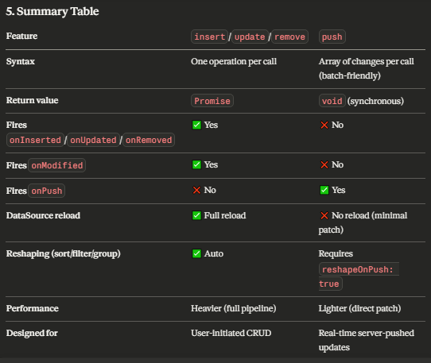

## ArrayStore

```js
var states = [
    { id: 1, state: "Alabama", capital: "Montgomery" },
    { id: 2, state: "Alaska", capital: "Juneau" },
    { id: 3, state: "Arizona", capital: "Phoenix" },
    // ...
];
 
var store = new DevExpress.data.ArrayStore({
    key: "id",
    data: states,
    // Other ArrayStore properties go here
});
 
// ===== or inside the DataSource =====
var dataSource = new DevExpress.data.DataSource({
    store: {
        type: "array",
        key: "id",
        data: states,
        // Other ArrayStore properties go here
    },
    // Other DataSource properties go here
});
```


## Options

| Option           | Type                            | Description                                     | Input                         | Output / Behavior                             | Possible Values           | Example                                             |
| ---------------- | ------------------------------- | ----------------------------------------------- | ----------------------------- | --------------------------------------------- | ------------------------- | --------------------------------------------------- |
| **data**         | `Array<any>`                    | The in-memory dataset used by the store         | Array of objects              | Stored internally and used for all operations | Any JS objects            | `js data: [{ id: 1, name: "John" }] `               |
| **key**          | `string \| string[]`            | Unique identifier field(s) for records          | Field name or array of fields | Enables CRUD operations and identification    | `"id"` or `["id","code"]` | `js key: "id" `                                     |
| **errorHandler** | `Function(error)`               | Handles errors thrown by the store              | Error object                  | Executes custom error logic                   | Any function              | `js errorHandler: e => console.log(e.message) `     |
| **onLoading**    | `Function(loadOptions)`         | Triggered before data is loaded                 | Load options object           | Can modify loading behavior                   | Any function              | `js onLoading: opts => console.log(opts) `          |
| **onLoaded**     | `Function(result, loadOptions)` | Triggered after data is loaded                  | Result array + load options   | Post-process loaded data                      | Any function              | `js onLoaded: data => console.log(data) `           |
| **onInserting**  | `Function(values)`              | Called before inserting a record                | Object being inserted         | Can validate/modify data                      | Any function              | `js onInserting: v => v.createdAt = new Date() `    |
| **onInserted**   | `Function(values, key)`         | Called after insertion                          | Inserted object + key         | Logging / UI update                           | Any function              | `js onInserted: (v,k)=>console.log(v,k) `           |
| **onUpdating**   | `Function(key, values)`         | Called before updating a record                 | Key + updated values          | Can validate/modify update                    | Any function              | `js onUpdating: (k,v)=>console.log(k,v) `           |
| **onUpdated**    | `Function(key, values)`         | Called after update                             | Key + updated values          | Post-update logic                             | Any function              | `js onUpdated: (k,v)=>console.log("Updated") `      |
| **onRemoving**   | `Function(key)`                 | Called before deleting a record                 | Key of record                 | Can cancel/validate delete                    | Any function              | `js onRemoving: k => confirm("Delete?") `           |
| **onRemoved**    | `Function(key)`                 | Called after deletion                           | Removed key                   | UI updates/logging                            | Any function              | `js onRemoved: k => console.log(k) `                |
| **onModifying**  | `Function()`                    | Called before any change (insert/update/delete) | None                          | Pre-change hook                               | Any function              | `js onModifying: ()=>console.log("Before change") ` |
| **onModified**   | `Function()`                    | Called after any change                         | None                          | Global change handler                         | Any function              | `js onModified: ()=>console.log("Changed") `        |
| **onPush**       | `Function(changes)`             | Called before push changes are applied          | Changes array                 | Modify pushed changes                         | Array of change objects   | `js onPush: changes => console.log(changes) `       |


## Methods

### 1. byKey(key)

```js
// The key consists of a single data field
var singleKeyStore = new DevExpress.data.ArrayStore({
    key: "field1",
    // ...
});
 
// Gets the data item with "field1" being equal to 1
singleKeyStore.byKey(1)
    .done(function (dataItem) {
        // Process the "dataItem" here
    })
    .fail(function (error) {
        // Handle the "error" here
    });
 
// The key consists of several data fields
var compositeKeyStore = new DevExpress.data.ArrayStore({
    key: [ "field1", "field2" ],
    // ...
});
 
// Gets the data item with both "field1" and "field2" being equal to 1
compositeKeyStore.byKey({
    field1: 1,
    field2: 1
}).done(function (dataItem) {
    // Process the "dataItem" here
})
.fail(function (error) {
    // Handle the "error" here
});
```

### 2. Clear()

### 3. createQuery()

```js
var store = new DevExpress.data.ArrayStore({
    // ArrayStore is configured here
});
 
var query = store.createQuery();
```
- It returns a Query object that allows you to process your data step by step.
- This query doesn’t execute immediately — it builds instructions. Execution happens when you call:

```js
query.toArray()
```

#### Query Methods

1. filter()

```js
store.createQuery()
    .filter(["age", ">", 23])
    .toArray()
    .done(function (result) {
        console.log(result);
    });
```

2. sortBy()

```js
store.createQuery()
    .sortBy("age", false) // false = descending
    .toArray()
    .done(function (result) {
        console.log(result);
    });
```

3. select()

```js
store.createQuery()
    .select(["name"])
    .toArray()
    .done(function (result) {
        console.log(result);
    });
```

4. slice()

```js
store.createQuery()
    .slice(0, 2)
    .toArray()
    .done(function (result) {
        console.log(result);
    });
```

5. Chaining Multiple Operations

```js
store.createQuery()
    .filter(["age", ">", 20])
    .sortBy("age")
    .select(["name", "age"])
    .toArray()
    .done(function (result) {
        console.log(result);
    });
```

### 4. insert(values)

```js
var store = new DevExpress.data.ArrayStore({
    // ArrayStore is configured here
});
 
store.insert({ id: 1, name: "temp" })
     .done(function (dataObj, key) {
         // Process the key and data object here
     })
     .fail(function (error) {
         // Handle the "error" here
     });
```
- The data item's key value should be unique, otherwise, the insertion will fail.

### 5. key()
- The key property's value.
```js
var store = new DevExpress.data.ArrayStore({
    // ...
    key: "ProductID"
});
 
var keyProps = store.key(); // returns "ProductID"
```

### 6. keyOf(obj)
- The data item's key value.
```js
var store = new DevExpress.data.ArrayStore({
    // ...
    key: "id"
});
 
var key = store.keyOf({ id: 1, name: "John Doe" });
```

### 6. load(options)
- start loading, resolve promise after data loaded

### 7. push(changes)

- Pushes data changes to the store and notifies the DataSource.

```js
var store = new DevExpress.data.ArrayStore({
    // ArrayStore is configured here
});
 
store.push([{ type: "insert", data: dataObj, index: index }]);
store.push([{ type: "update", data: dataObj, key: key }]);
store.push([{ type: "remove", key: key }]);
```

- The DataSource does not automatically sort, group, filter, or otherwise shape pushed data. For this reason, the DataSource and the UI component bound to it can be out of sync. To prevent this, enable the reshapeOnPush property. 

### 8. remove(key)

- remove data item with specific key

```js
// The key consists of a single data field
var singleKeyStore = new DevExpress.data.ArrayStore({
    key: "field1",
    // ...
});
 
// Removes the data item with "field1" being equal to 1
singleKeyStore.remove(1)
    .done(function (key) {
        // Process the "key" here
    })
    .fail(function (error) {
        // Handle the "error" here
    });
 
// The key consists of several data fields
var compositeKeyStore = new DevExpress.data.ArrayStore({
    key: [ "field1", "field2" ],
    // ...
});
 
// Removes the data item with both "field1" and "field2" being equal to 1
compositeKeyStore.remove({
    field1: 1,
    field2: 1
}).done(function (key) {
    // Process the "key" here
})
.fail(function (error) {
    // Handle the "error" here
});
```

### 9. totalCount(options)

```js
var store = new DevExpress.data.ArrayStore({
    // ArrayStore is configured here
});
 
store.totalCount()
     .done(function (count) {
         // Process the "count" here
     })
     .fail(function (error) {
         // Handle the "error" here
     });
```

### 10. update(key, values)

```js
var singleKeyStore = new DevExpress.data.ArrayStore({
    key: "field1",
    // ...
});
 
// Updates the data item with "field1" being equal to 1
singleKeyStore.update(1, { name: "John Smith" })
    .done(function (dataObj, key) {
        // Process the key and data object here
    })
    .fail(function (error) {
        // Handle the "error" here
    });
 
// The key consists of several data fields
var compositeKeyStore = new DevExpress.data.ArrayStore({
    key: [ "field1", "field2" ],
    // ...
});
 
// Updates the data item with both "field1" and "field2" being equal to 1
compositeKeyStore.update(
    { field1: 1, field2: 1 },
    { name: "John Smith" }
).done(function (dataObj, key) {
    // Process the key and data object here
})
.fail(function (error) {
    // Handle the "error" here
});
```

## push vs Insert/update/delete

