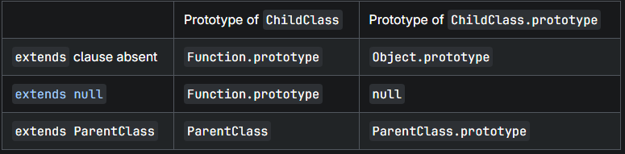

## Class

```js
class Polygon {
  constructor(height, width) {
    this.area = height * width;
  }
}

class name {
  // class body
}
class name extends otherName {
  // class body
}
```

- The class body of a class declaration is executed in strict mode. 
- class declarations are scoped to blocks as well as functions.
- class declarations can only be accessed after the place of declaration is reached
- class declarations cannot be redeclared by any other declaration in the same scope.
- Outside the class body, class declarations can be re-assigned like let : 

```js
class Foo {
  static {
    Foo = 1; // TypeError: Assignment to constant variable.
  }
}

class Foo2 {
  bar = (Foo2 = 1); // TypeError: Assignment to constant variable.
}

class Foo3 {}
Foo3 = 1;
console.log(Foo3); // 1
```

- Classes are syntax sugar over constructor functions

```js
class Box {
  constructor(value) {
    this.value = value;
  }

  // Methods are created on Box.prototype
  getValue() {
    return this.value;
  }
}


// behind the scene
function Box(value) {
  this.value = value;
}
Box.prototype.getValue = function () {
  return this.value;
};
const box = new Box(1);
box.getValue(); // 1
```

## constructor

```js
constructor() {
    this.name = "Polygon";
}
```

- The constructor method may have a return value. 
- While the base class may return anything from its constructor, the derived class must return an object or undefined, or a TypeError will be thrown.

```js
class ParentClass {
  constructor() {
    return 1;
  }
}

console.log(new ParentClass()); // ParentClass {}
// The return value is ignored because it's not an object
// This is consistent with function constructors

class ChildClass extends ParentClass {
  constructor() {
    return 1;
  }
}

console.log(new ChildClass()); // TypeError: Derived constructors may only return object or undefined
```


## Inheritance and the prototype chain

- JavaScript implements inheritance by using objects.
- Each object has an internal link to another object called its prototype.

### prototype chain

```js
const o = {
  a: 1,
  b: 2,
  // __proto__ sets the [[Prototype]].
  __proto__: {
    b: 3,
    c: 4,
  },
};

// o.[[Prototype]] has properties b and c.
// o.[[Prototype]].[[Prototype]] is Object.prototype 
// Finally, o.[[Prototype]].[[Prototype]].[[Prototype]] is null.
// { a: 1, b: 2 } ---> { b: 3, c: 4 } ---> Object.prototype ---> null

console.log(o.a); // 1
console.log(o.b); // 2
console.log(o.c); // 4
console.log(o.d); // undefined
// Is there a 'd' own property on o? No, check its prototype.
// Is there a 'd' own property on o.[[Prototype]]? No, check its prototype.
// o.[[Prototype]].[[Prototype]] is Object.prototype and
// there is no 'd' property by default, check its prototype.
// o.[[Prototype]].[[Prototype]].[[Prototype]] is null, stop searching,
// no property found, return undefined.
```


- create longer prototype chains

```js
const o = {
  a: 1,
  b: 2,
  // __proto__ sets the [[Prototype]].
  __proto__: {
    b: 3,
    c: 4,
    __proto__: {
      d: 5,
    },
  },
};

// { a: 1, b: 2 } ---> { b: 3, c: 4 } ---> { d: 5 } ---> Object.prototype ---> null

console.log(o.d); // 5
```

## extends

- The extends keyword is used in class declarations or class expressions to create a class that is a child of another class.

```js
class ChildClass extends ParentClass { /* … */ }
```



## super

- The super keyword is used to access properties on an object literal or class's [[Prototype]], or invoke a superclass's constructor.
- The super.prop and super[expr] expressions are valid in any method definition in both classes and object literals. The super(...args) expression is valid in class constructors.

```js
super()
super(arg1)
super(arg1, arg2)
super(arg1, arg2, /* …, */ argN)

super.propertyOnParent
super[expression]
```

- In the constructor body of a derived class (with extends), the super keyword may appear as a "function call" (super(...args)), which must be called before the this keyword is used, and before the constructor returns. 
- It calls the parent class's constructor and binds the parent class's public fields, after which the derived class's constructor can further access and modify this.

```js
class Rectangle {
  constructor(height, width) {
    this.name = "Rectangle";
    this.height = height;
    this.width = width;
  }
  sayName() {
    console.log(`Hi, I am a ${this.name}.`);
  }
  get area() {
    return this.height * this.width;
  }
  set area(value) {
    this._area = value;
  }
}

class Square extends Rectangle {
  constructor(length) {
    // Here, it calls the parent class's constructor with lengths
    // provided for the Rectangle's width and height
    super(length, length);

    // Note: In derived classes, super() must be called before you
    // can use 'this'. Moving this to the top causes a ReferenceError.
    this.name = "Square";
  }
}
```

- Super-calling static methods

```js
class Rectangle {
  static logNbSides() {
    return "I have 4 sides";
  }
}

class Square extends Rectangle {
  static logDescription() {
    return `${super.logNbSides()} which are all equal`;
  }
}
Square.logDescription(); // 'I have 4 sides which are all equal'
```

- Note that instance fields are set on the instance instead of the constructor's prototype, so you can't use super to access the instance field of a superclass.


## Private elements

- Private elements get created by using a hash # prefix and cannot be legally referenced outside of the class.

- Note: On MDN, we avoid using the term "private property". A property in JavaScript has a string or symbol key, and has attributes like writable, enumerable, and configurable, but private elements have none. While private elements are accessed with the familiar dot notation, they cannot be proxied, enumerated, deleted, or interacted with using any Object method.

```js
class ClassWithPrivate {
  #privateField;
  #privateFieldWithInitializer = 42;

  #privateMethod() {
    // …
  }

  static #privateStaticField;
  static #privateStaticFieldWithInitializer = 42;

  static #privateStaticMethod() {
    // …
  }
}
```

## static

- Static properties cannot be directly accessed on instances of the class. Instead, they're accessed on the class itself.

```js
class ClassWithStaticMethod {
  static staticProperty = "someValue";
  static staticMethod() {
    return "static method has been called.";
  }
  static {
    console.log("Class static initialization block called");
  }
}

console.log(ClassWithStaticMethod.staticProperty);
// Expected output: "someValue"
console.log(ClassWithStaticMethod.staticMethod());
// Expected output: "static method has been called."

```

- The name of a static property (field or method) cannot be prototype.
- The name of a class field (static or instance) cannot be constructor.

```js
class StaticMethodCall {
  static staticProperty = "static property";
  static staticMethod() {
    return `Static method and ${this.staticProperty} has been called`;
  }
  static anotherStaticMethod() {
    return `${this.staticMethod()} from another static method`;
  }
}
StaticMethodCall.staticMethod();
// 'Static method and static property has been called'

StaticMethodCall.anotherStaticMethod();
// 'Static method and static property has been called from another static method'
```

```js
class StaticMethodCall {
  constructor() {
    console.log(StaticMethodCall.staticProperty); // 'static property'
    console.log(this.constructor.staticProperty); // 'static property'
    console.log(StaticMethodCall.staticMethod()); // 'static method has been called.'
    console.log(this.constructor.staticMethod()); // 'static method has been called.'
  }

  static staticProperty = "static property";
  static staticMethod() {
    return "static method has been called.";
  }
}
```

## Static initialization blocks

- It contains statements to be evaluated during class initialization.
- This permits more flexible initialization logic than static properties, such as using try...catch or setting multiple fields from a single value.

```js
class ClassWithStaticInitializationBlock {
  static staticProperty1 = "Property 1";
  static staticProperty2;
  static {
    this.staticProperty2 = "Property 2";
  }
}

console.log(ClassWithStaticInitializationBlock.staticProperty1);
// Expected output: "Property 1"
console.log(ClassWithStaticInitializationBlock.staticProperty2);
// Expected output: "Property 2"
```

### Multiple blocks

```js
class MyClass {
  static field1 = console.log("static field1");
  static {
    console.log("static block1");
  }
  static field2 = console.log("static field2");
  static {
    console.log("static block2");
  }
}
// 'static field1'
// 'static block1'
// 'static field2'
// 'static block2'

```

- Note that any static initialization of a super class is performed first, before that of its sub classes.

```js
class A {
  static field = "static field";
}

class B extends A {
  static {
    console.log(super.field);
  }
}
// 'static field'
```

### Access to private elements

```js
let getDPrivateField;

class D {
  #privateField;
  constructor(v) {
    this.#privateField = v;
  }
  static {
    getDPrivateField = (d) => d.#privateField;
  }
}

console.log(getDPrivateField(new D("private"))); // 'private'
```


## inheritance

- Inheritance allows one class to inherit properties and methods from another. JavaScript uses prototype-based inheritance, but with the ES6 class syntax, inheritance is more clearly defined with the extends keyword.

```js
class Animal {
    constructor(name) {
        this.name = name;
    }

    speak() {
        console.log(this.name + " makes a sound");
    }
}

class Dog extends Animal {
    constructor(name, breed) {
        super(name);  // Calls the parent constructor
        this.breed = breed;
    }

    speak() {
        console.log(this.name + " barks");
    }
}

const dog = new Dog("Buddy", "Golden Retriever");
dog.speak();  // Output: Buddy barks

```

## encapsulation

- Encapsulation is the practice of bundling the data (properties) and the methods (functions) that operate on the data into a single unit or class. It also restricts direct access to some of an object's components, which is often done via getters and setters.

```js
class Person {
    constructor(firstName, lastName, age) {
        this.firstName = firstName;
        this.lastName = lastName;
        this._age = age; // Private property convention (not truly private)
    }

    // Getter for age
    get age() {
        return this._age;
    }

    // Setter for age
    set age(value) {
        if (value >= 0) {
            this._age = value;
        } else {
            console.log("Age must be a positive number");
        }
    }

    greet() {
        console.log("Hello, " + this.firstName + " " + this.lastName);
    }
}

const person = new Person("John", "Doe", 30);
person.age = 35;  // Setter is called
console.log(person.age);  // Getter is called, Output: 35
```

## polymorphism

- Polymorphism allows methods to have different behaviors based on the object that is calling them. In JavaScript, polymorphism is often achieved through method overriding, where a child class overrides a method from its parent class.

```js
class Animal {
    speak() {
        console.log("Animal makes a sound");
    }
}

class Dog extends Animal {
    speak() {
        console.log("Dog barks");
    }
}

class Cat extends Animal {
    speak() {
        console.log("Cat meows");
    }
}

const animal = new Animal();
const dog = new Dog();
const cat = new Cat();

animal.speak();  // Output: Animal makes a sound
dog.speak();     // Output: Dog barks
cat.speak();     // Output: Cat meows
```

## Abstraction

- Abstraction is the concept of hiding complex implementation details and exposing only the necessary parts of an object. In JavaScript, abstraction can be achieved via abstract methods or by using private properties.

```js
class Shape {
    constructor() {
        if (this.constructor === Shape) {
            throw new Error("Abstract class cannot be instantiated");
        }
    }

    area() {
        throw new Error("Method 'area()' must be implemented.");
    }
}

class Circle extends Shape {
    constructor(radius) {
        super();
        this.radius = radius;
    }

    area() {
        return Math.PI * this.radius * this.radius;
    }
}

const circle = new Circle(5);
console.log(circle.area());  // Output: 78.53981633974483

```

## Getters and Setters

- Getters and setters provide a way to define how a property is accessed or modified. This is useful for controlling and validating property values before they are set or retrieved.

```js
class Car {
    constructor(model, year) {
        this._model = model;
        this._year = year;
    }

    get model() {
        return this._model;
    }

    set model(newModel) {
        if (newModel.length > 0) {
            this._model = newModel;
        } else {
            console.log("Model name cannot be empty");
        }
    }
}

let car = new Car("Tesla", 2023);
console.log(car.model);  // Output: Tesla
car.model = "BMW";  // Setting the model
console.log(car.model);  // Output: BMW

```
