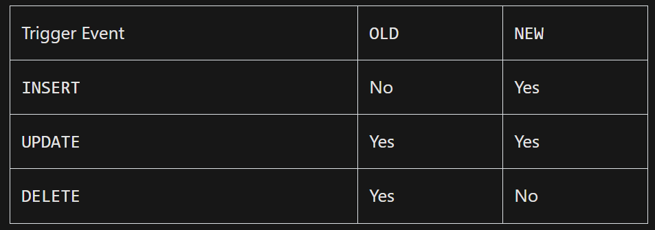

# MySQL Documentation: Trigger

## Table of Contents
1. [Create Trigger](#createtrigger)
---
## Create Trigger

#### Syntax

```sql
CREATE TRIGGER trigger_name
{BEFORE | AFTER} {INSERT | UPDATE | DELETE}
ON table_name
FOR EACH ROW
BEGIN
    -- Trigger body (SQL statements)
END;
```

In this syntax:

1. trigger_name: Name of the trigger.
2. BEFORE or AFTER: Specifies when the trigger should be executed.
3. INSERT, UPDATE, or DELETE: Specifies the type of operation that activates the trigger.
4. table_name: Name of the table on which the trigger is defined.
5. FOR EACH ROW: Indicates that the trigger should be executed once for each row affected by the triggering event.
6. BEGIN and END: Delimit the trigger body, where you define the SQL statements to be executed.

- To distinguish between the value of the columns BEFORE and AFTER the event has fired, you use the NEW and OLD modifiers.

- For example, if you update the value in the description column, in the trigger body, you can access the value of the description column before the update OLD.description and the new value NEW.description.


