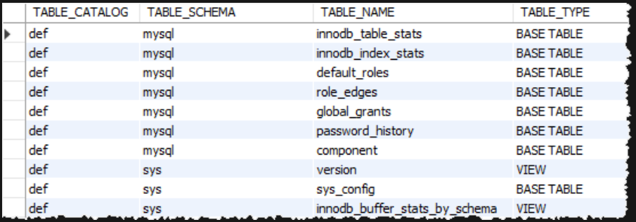

# MySQL Documentation: View

## Table of Contents
1. [Create View](#create_view)
2. [View Processing Algorithms](#View_Processing_Algorithms)
3. [Alter View](#Alter_View)
4. [Updatable View](#Updatable_View)
5. [WITH CHECK OPTION clause for View](#WITH_CHECK_OPTION_clause)
6. [LOCAL & CASCADED in WITH CHECK OPTION Clause](#LOCAL_CASCADED_WITH_CHECK_OPTION_clause)
7. [Show View](#Show_Views)
8. [Rename View](#Rename_View)
9. [Drop View](#Drop_View)

---
## Create_View  

#### Syntax

```sql
CREATE [OR REPLACE] VIEW [db_name.]view_name [(column_list)]
AS
  select-statement;
```

In this syntax:

- First, specify the name of the view that you want to create after the CREATE VIEW keywords. The name of the view is unique in a database. Because views and tables in the same database share the same namespace, the name a view cannot the same as the name of an existing table.

- Second, use the OR REPLACE option if you want to replace an existing view if the view already exists. If the view does not exist, the OR REPLACE has no effect.

- Third, specify a list of columns for the view. By default, the columns of the view are derived from the select list of the SELECT statement. However, you can explicitly specify the column list for the view by listing them in parentheses following the view name.

- Finally,  specify a SELECT statement that defines the view. The SELECT  statement can query data from tables or views. MySQL allows you to use the ORDER BY clause in the SELECT statement but ignores it if you select from the view with a query that has its own ORDER BY clause.

- By default, the CREATE VIEW statement creates a view in the current database. If you want to explicitly create a view in a given database, you can qualify the view name with the database name.


#### 1) Creating a simple view example

```sql
CREATE VIEW salePerOrder AS
    SELECT 
        orderNumber, 
        SUM(quantityOrdered * priceEach) total
    FROM
        orderDetails
    GROUP by orderNumber
    ORDER BY total DESC;
```

#### 2) Creating a view with explicit view columns example

```sql
CREATE VIEW customerOrderStats (
   customerName , 
   orderCount
) 
AS
    SELECT 
        customerName, 
        COUNT(orderNumber)
    FROM
        customers
            INNER JOIN
        orders USING (customerNumber)
    GROUP BY customerName;
```

---

## View_Processing_Algorithms

#### Syntax

```sql
CREATE [OR REPLACE][ALGORITHM = {MERGE | TEMPTABLE | UNDEFINED}] VIEW 
   view_name[(column_list)]
AS 
   select-statement;


CREATE [ALGORITHM = {MERGE | TEMPTABLE | UNDEFINED}] VIEW 
   view_name[(column_list)] 
AS 
   select-statement;

```

#### MERGE

When you query from a MERGE view, MySQL processes the following steps:

- First, merge the input query with the SELECT statement in the view definition into a single query.
- Then, execute the combined query to return the result set.

Note that the combination of input query and the SELECT statement of the view definition into a single query is referred to as view resolution.

#### TEMPTABLE

When you issue a query to a TEMPTABLE view, MySQL performs these steps:

- First, create a temporary table to store the result of the SELECT in the view definition.
- Then, execute the input query against the temporary table.

Because MySQL has to create the temporary table to store the result set and moves the data from the base tables to the temporary table, the algorithm TEMPTABLE  is less efficient than the MERGE algorithm.

Note that TEMPTABLE views cannot be updatable.

#### UNDEFINED

The UNDEFINED is the default algorithm when you create a view without specifying the ALGORITHM clause or you explicitly specify ALGORITHM=UNDEFINED.

In addition, when you create a view with ALGORITHM = MERGE and MySQL can only process the view with a temporary table, MySQL automatically sets the algorithm to UNDEFINED and generates a warning.

TheUNDEFINED allows MySQL to choose either MERGE or TEMPTABLE. And MySQL prefers MERGE  over TEMPTABLE  if possible because MERGE is often more efficient than TEMPTABLE.

---

## Alter_View

#### Syntax

```sql
ALTER
    [ALGORITHM = {UNDEFINED | MERGE | TEMPTABLE}]
    VIEW view_name [(column_list)]
    AS select_statement;
```

#### Example

```sql
ALTER 
    ALGORITHM=MERGE
VIEW salesOrders AS
    SELECT 
        orderNumber, 
        customerNumber,
        productCode,
        quantityOrdered, 
        priceEach, 
        status
    FROM
        orders
    INNER JOIN
        orderDetails USING (orderNumber);    
```

---

## Updatable_View

In MySQL, views are not only queryable but also updatable. This implies that you can use the INSERT or UPDATE statement to add or modify rows of the base table through the updatable view.

Additionally, you can use the DELETE statement to remove rows of the underlying table via the view.

- If you create a view with the TEMPTABLE algorithm, the view is not updatable.

- Note that it is possible to create updatable views based on multiple tables using an inner join.

- Views containing DISTINCT, GROUP BY, HAVING, UNION, or UNION ALL clauses are not updateable.

#### Checking updatable view information

First, create a table named items, insert some rows into the items table, and create a view that contains items whose prices are greater than 700.

```sql
-- create a new table named items
CREATE TABLE items (
    id INT AUTO_INCREMENT PRIMARY KEY,
    name VARCHAR(100) NOT NULL,
    price DECIMAL(11 , 2 ) NOT NULL
);

-- insert data into the items table
INSERT INTO items(name,price) 
VALUES('Laptop',700.56),('Desktop',699.99),('iPad',700.50) ;

-- create a view based on items table
CREATE VIEW LuxuryItems AS
    SELECT 
        *
    FROM
        items
    WHERE
        price > 700;

-- query data from the LuxuryItems view
SELECT 
    *
FROM
    LuxuryItems;
```

Second, use the DELETE statement to remove a row with id value 3.

```sql
DELETE FROM LuxuryItems 
WHERE id = 3;
```

query the data from the base table items to verify if the DELETE statement deleted the row.
The output shows that the row with id 3 was removed from the base table.

---

## WITH_CHECK_OPTION_clause

Sometimes, you create a view to reveal the partial data of a table. However, a simple view is updatable, and therefore, it is possible to update data that is not visible through the view. This update makes the view inconsistent.

To ensure the consistency of the view, you use the WITH CHECK OPTION clause when you create or modify the view.

The WITH CHECK OPTION is an optional clause of the CREATE VIEW statement. This WITH CHECK OPTION prevents you from updating or inserting rows that are not visible through the view.

#### Syntax 

```sql
CREATE OR REPLACE VIEW view_name 
AS
  select_statement
WITH CHECK OPTION;
```
In this syntax, you add the WITH CHECK OPTION clause at the end of the CREATE VIEW statement.

#### Example

```sql
CREATE OR REPLACE VIEW contractors 
AS 
SELECT id, type, name 
FROM 
  employees 
WHERE 
  type = 'Contractor'
WITH CHECK OPTION;
```

If you attempt to insert or update rows that are not visible via the contractor, you’ll get an error. For example:

```sql
INSERT INTO contractors(name, type)
VALUES('Brad Knox', 'Full-time');
```
#### Output

```sql
ERROR 1369 (HY000): CHECK OPTION failed 'mydb.contractors'
```

---

## LOCAL_CASCADED_WITH_CHECK_OPTION_clause

When you create a view with the WITH CHECK OPTION clause and issue a DML statement against the view such as INSERT, UPDATE, and DELETE, MySQL checks to ensure that the rows that are being changed are conformable to the definition of the view.

Because a view can be created based on other views, MySQL also checks the rules in the dependent views for data consistency.

To determine the scope of the check, MySQL provides two options: LOCAL and CASCADED. If you don’t specify the keyword explicitly in the WITH CHECK OPTION clause, MySQL uses CASCADED by default.

### CASCADED CHECK OPTION

```sql
CREATE TABLE t1 (
    c INT
);


CREATE OR REPLACE VIEW v1 
AS
    SELECT 
        c
    FROM
        t1
    WHERE
        c > 10;


CREATE OR REPLACE VIEW v2 
AS
    SELECT c FROM v1 
WITH CASCADED CHECK OPTION;


CREATE OR REPLACE VIEW v3 
AS
    SELECT c
    FROM v2
    WHERE c < 20;
```

- when a view uses a WITH CASCADED CHECK OPTION, MySQL checks the rules of the view and also the rules of the underlying views recursively.


### MySQL WITH LOCAL CHECK OPTION

```sql
ALTER VIEW v2 AS
    SELECT 
        c
    FROM
        v1 
WITH LOCAL CHECK OPTION;
```

- if a view uses a WITH LOCAL CHECK OPTION, MySQL checks the rules of views that have a WITH LOCAL CHECK OPTION and a WITH CASCADED CHECK OPTION.

- if you use a view with a WITH LOCAL CHECK OPTION, MySQL only checks the rules of the current view and it does not check the rules of the underlying views.


---

## Show_Views

#### Syntax

```sql
SHOW FULL TABLES
[{FROM | IN } database_name]
WHERE table_type = 'VIEW';
```

- If you use the SHOW TABLE command to view all tables in the classicmodels database, you will see the viewsalesPerOrder is showing up in the list.

```sql
SHOW TABLES;
```


```sql
SHOW FULL TABLES;
```


#### INFORMATION_SCHEMA database

The information_schema database provides access to MySQL database metadata such as databases, tables, data types of columns, or privileges. The information schema is also known as a database dictionary or system catalog.

To show the views of a database, you use the tables table from the information_schema database:

```sql
SELECT * 
FROM information_schema.tables;
```



#### SHOW CREATE VIEW

The SHOW CREATE VIEW statement allows you to display the statement that creates a view. Here’s the basic syntax:

```sql
SHOW CREATE VIEW view_name;
```

---

## Rename_View

In MySQL, views and tables share the same namespace. Therefore, you can use the RENAME TABLE statement to rename a view.

Here’s the basic syntax of the RENAME TABLE for renaming a view:

```sql
RENAME TABLE original_view_name 
TO new_view_name;
```

In this syntax:

- First, specify the view’s name that you want to rename after the RENAME TABLE keywords.
- Then, specify the new name of the view after the TO keyword.

Note that you cannot use the RENAME TABLE statement to move a view from one database to another. If you attempt to do so, MySQL will issue an error.


---

## Drop_View

The DROP VIEW statement deletes a view completely from the database. Here’s the basic syntax of the DROP VIEW statement:

```sql
DROP VIEW [IF EXISTS] view_name;

DROP VIEW [IF EXISTS] view_name1 [,view_name2]...;

```

the DROP VIEW returns an error if there is any non-existing view. However, it drops the views that exist.
